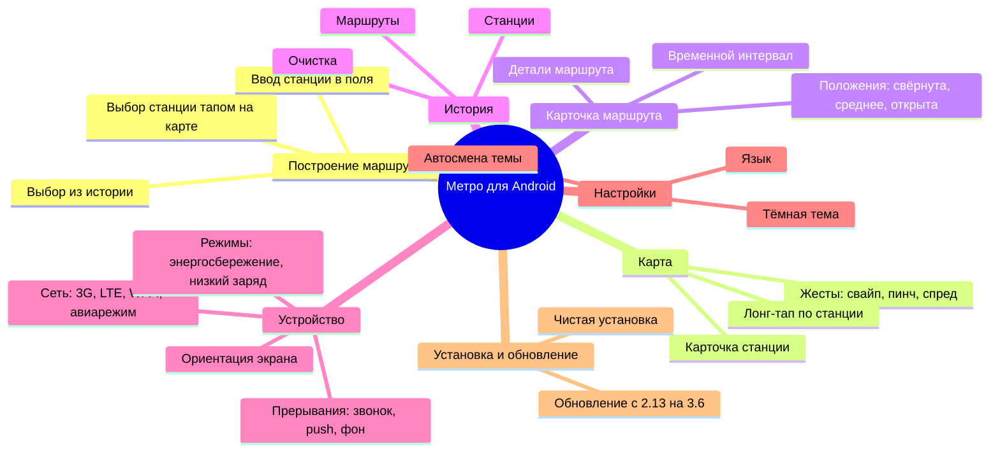

# Декомпозиция мобильного приложения

```mermaid
mindmap
  root((Метро для Android))
    Построение маршрута
      Ввод станций в поля
      Выбор станции тапом на карте
      Выбор из истории
    Карта
      Жесты: свайп, пинч, спред
      Лонг-тап по станции
      Карточка станции
    Карточка маршрута
      Временной интервал
      Положения: свёрнута, среднее, открыта
      Детали маршрута
    История
      Станции
      Маршруты
      Очистка
    Устройство
      Ориентация экрана
      Сеть: 3G, LTE, Wi-Fi, авиарежим
      Прерывания: звонок, push, фон
      Режимы: энергосбережение, низкий заряд
    Настройки
      Тёмная тема
      Автосмена темы
      Язык
    Установка и обновление
      Чистая установка
      Обновление с 2.13 на 3.6
```
